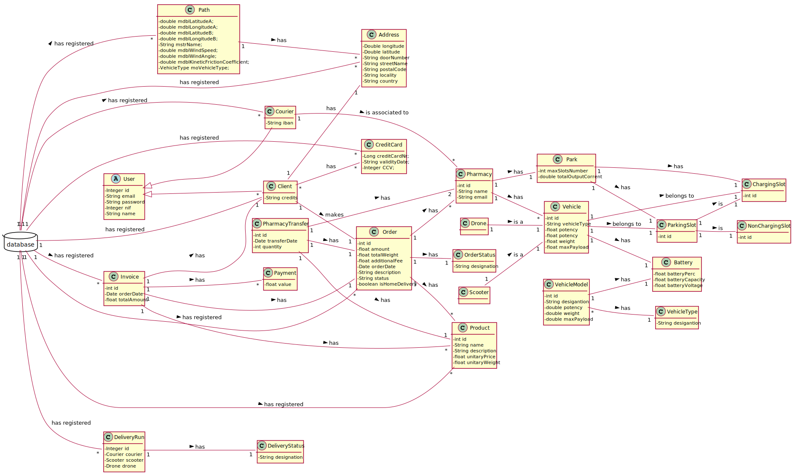

# README

This is the repository template used for student repositories in LAPR Projets.

## Java source files

Java source and test files are located in folder src.

## Maven file

Pom.xml file controls the project build.

# Notes
In this file, DO NOT EDIT the following elements:

* groupID
* artifactID
* version
* properties

Beside, students can only add dependencies to the specified section of this file.

## Eclipse files

The following files are solely used by Eclipse IDE:

* .classpath
* .project

## IntelliJ Idea IDE files

The following folder is solely used by Intellij Idea IDE :

* .idea

# How was the .gitignore file generated?
.gitignore file was generated based on https://www.gitignore.io/ with the following keywords:

  - Java
  - Maven
  - Eclipse
  - NetBeans
  - Intellij

# Who do I talk to?
In case you have any problem, please email Nuno Bettencourt (nmb@isep.ipp.pt).

# How do I use Maven?

## How to run unit tests?

Execute the "test" goals.

`$ mvn test`

## How to generate the javadoc for source code?

Execute the "javadoc:javadoc" goal.

`$ mvn javadoc:javadoc`

This generates the source code javadoc in folder "target/site/apidocs/index.html".

## How to generate the javadoc for test cases code?

Execute the "javadoc:test-javadoc" goal.

`$ mvn javadoc:test-javadoc`

This generates the test cases javadoc in folder "target/site/testapidocs/index.html".

## How to generate Jacoco's Code Coverage Report?

Execute the "jacoco:report" goal.

`$ mvn test jacoco:report`

This generates a jacoco code coverage report in folder "target/site/jacoco/index.html".

## How to generate PIT Mutation Code Coverage?

Execute the "org.pitest:pitest-maven:mutationCoverage" goal.

`$ mvn test org.pitest:pitest-maven:mutationCoverage`

This generates a PIT Mutation coverage report in folder "target/pit-reports/YYYYMMDDHHMI".

## How to combine different maven goals in one step?

You can combine different maven goals in the same command. For example, to locally run your project just like on jenkins, use:

`$ mvn clean test jacoco:report org.pitest:pitest-maven:mutationCoverage`

## How to perform a faster pit mutation analysis?

Do not clean build => remove "clean"

Reuse the previous report => add "-Dsonar.pitest.mode=reuseReport"

Use more threads to perform the analysis. The number is dependent on each computer CPU => add "-Dthreads=4"

Temporarily remove timestamps from reports.

Example:

`$ mvn test jacoco:report org.pitest:pitest-maven:mutationCoverage -DhistoryInputFile=target/fasterPitMutationTesting-history.txt -DhistoryOutputFile=target/fasterPitMutationTesting-history.txt -Dsonar.pitest.mode=reuseReport -Dthreads=4 -DtimestampedReports=false`

## Where do I configure my database connection?

Each group should configure their database connection on file: 

* src/main/resources/application.properties

# Oracle repository

If you get the following error:

```
[ERROR] Failed to execute goal on project 
bike-sharing: Could not resolve dependencies for project 
lapr3:bike-sharing:jar:1.0-SNAPSHOT: 
Failed to collect dependencies at 
com.oracle.jdbc:ojdbc7:jar:12.1.0.2: 
Failed to read artifact descriptor for 
com.oracle.jdbc:ojdbc7:jar:12.1.0.2: 
Could not transfer artifact 
com.oracle.jdbc:ojdbc7:pom:12.1.0.2 
from/to maven.oracle.com (https://maven.oracle.com): 
Not authorized , ReasonPhrase:Authorization Required. 
-> [Help 1]
```

Follow these steps:

https://blogs.oracle.com/dev2dev/get-oracle-jdbc-drivers-and-ucp-from-oracle-maven-repository-without-ides

You do not need to set a proxy.

You can use existing dummy Oracle credentials available at http://bugmenot.com.

# Project Report

This part of the Readme file will explain the purpose of our LAPR3 Project, our approaches and some considerations regarding the work done.

About the project, we want to mention this **3** topics:
### 1. Goal
* The goal of our LAPR3 project was to develop a full functional software that supports the delivery of pharmaceutics products.
* This software has to be capable of handling customers, pharmacies, orders, deliveries, users, products. 
1. Client 
    
    1.1 A client has to be capable of registering himself.([US18_RegisterClient](docs/Iteration 3/User Management/Refinement/US18_RegisterClient/US18_RegisterClient.md)) 

    1.2 A client has to be capable of making an order.([US25_MakeAnOrder](docs/Iteration 3/Make An Order/Refinement/US25_MakeAnOrder/US25_MakeAnOrder.md))

2. Pharmacies

    2.1 The Administrator should be capable of registering a pharmacy. ([US40_RegisterPharmacy](docs/Iteration%203/Pharmacy%20Management/Refinement/US40_RegisterPharmacy/US40_RegisterPharmacy.md)) 

    2.2 The Administrator should be capable of update a pharmacy. ([US53_UpdatePharmacy](docs/Iteration 3/Pharmacy Management/Refinement/US53_UpdatePharmacy/US53_UpdatePharmacy.md))
   
    2.3 The Administrator should be capable of adding products to the pharmacy. ([US64_AddPharmacyProducts](docs/Iteration 3/Pharmacy Management/Refinement/US64_AddPharmacyProducts/US64_AddPharmacyProducts.md))
    
    2.4 The Administrator should be capable of making a product transfer between pharmacies. ([US200_MakeAPharmacyTransfer](docs/Iteration 3/Pharmacy Management/Refinement/US200_MakeAPharmacyTransfer/US200_MakeAPharmacyTransfer.md))
    
    2.5 As necessary, the program should be capable of transfering stock between pharmacies and issuing a transfer note. ([US202_IssueTransferNote](docs/Iteration 3/Pharmacy Management/Refinement/US202_IssueTransferNote/US202_IssueTransferNote.md))

    2.6 The Administrator should be capable of issuing a pharmacy transfer delivery note. ([US203_IssueDeliveryNote](docs/Iteration 3/Pharmacy Management/Refinement/US203_IssueDeliveryNote/US203_IssueDeliveryNote.md))

3. Orders
   
   3.1 The system generates an invoice. ([US26_GenerateInvoice](docs/Iteration 3/Make An Order/Refinement/US26_GenerateInvoice/US26_GenerateInvoice.md))

   3.2 The order can't be done, therefore, the client is notified, and the order is removed. ([US74_NotifyAndRemove](docs/Iteration 3/Make An Order/Refinement/US74_NotifyAndRemove/US74_NotifyAndRemove.md))

   3.3 Know the order associated to a courier. ([US48_KnowDelivery](docs/Iteration 3/Delivery Management/Refinement/US48_KnowDelivery/US48_KnowDelivery.md))
   
4. Deliveries

   4.1 Courier
      
   - 4.1.1 An administrator should be able of register a courier. ([US19_RegisterCourier](docs/Iteration 3/Courier Management/Refinement/US19_RegisterCourier/US19_RegisterCourier.md))
   - 4.1.2 An administrator should be able of remove a courier. ([US20_RemoveCourier](docs/Iteration 3/Courier Management/Refinement/US20_RemoveCourier/US20_RemoveCourier.md))
   - 4.1.3 An administrator should be able of update a courier. ([US29_UpdateCourier](docs/Iteration 3/Courier Management/Refinement/US29_UpdateCourier/US29_UpdateCourier.md))
   
   4.2 Vehicles
   
   - 4.2.1 **Scooter**
        - 4.2.1.1 An administrator should be able of register a scooter.([US21_RegisterScooter](docs/Iteration 3/Scooter Management/Refinement/US21_RegisterScooter/US21_RegisterScooter.md))
        - 4.2.1.2 An administrator should be able of remove a scooter.([US22_RemoveScooter](docs/Iteration 3/Scooter Management/Refinement/US22_RemoveScooter/US22_RemoveScooter.md))
        - 4.2.1.3 An administrator should be able of update a scooter.([US32_UpdateScooter](docs/Iteration 3/Scooter Management/Refinement/US32_UpdateScooter/US32_UpdateScooter.md))
        - 4.2.1.4 An administrator should be able of see the scooter information.([US57_ScooterInformation](docs/Iteration 3/Scooter Management/Refinement/US57_ScooterInformation/US57_ScooterInformation.md))
        - 4.2.1.5 An courier should be able of park a scooter.([US289_SplitChargingCapacity](docs/Iteration 3/Scooter Management/US289_SplitChargingCapacity/US289_SplitChargingCapacity.md))
   - 4.2.2 **Drone**
      - 4.2.2.1 An administrator should be able of register a drone.([US193_RegisterDrone](docs/Iteration 3/Drone Management/Refinement/US193_RegisterDrone/US193_RegisterDrone.md))
      - 4.2.2.2 An administrator should be able of remove a drone.([US194_RemoveDrone](docs/Iteration 3/Drone Management/Refinement/US194_RemoveDrone/US194_RemoveDrone.md))
      - 4.2.2.3 An administrator should be able of update a drone.([US195_UpdateDrone](docs/Iteration 3/Drone Management/Refinement/US195_UpdateDrone/US195_UpdateDrone.md))
   - 4.2.3 **Both**
      - 4.2.3.1 An administrator should be able of know the vehicle maximum payload. ([US55_MaxPayload](docs/Iteration 3/Delivery Management/Refinement/US55_MaxPayload/US55_MaxPayload.md))
      - 4.2.3.2 An administrator should be able of know the best vehicle for an order.([US290_SeeSuitableVehicle](docs/Iteration 3/Delivery Management/Refinement/US290_SeeSuitableVehicle/US290_SeeSuitableVehicle.md))
      
   4.3 Delivery Run
      - 4.3.1
      - 4.3.2
   
5. Users
   
   5.1 A user has to be capable of loging in ([US67_Login](docs/Iteration 3/User Management/Refinement/US67_Login/US67_Login.md))

   5.2 A user has to be capable of loging out ([US68_Logout](docs/Iteration 3/User Management/Refinement/US68_Logout/US68_Logout.md))

6. Products

### Objectives

# Relational Model (Normalized)


# Domain Model
// not ready


# Class Diagram
