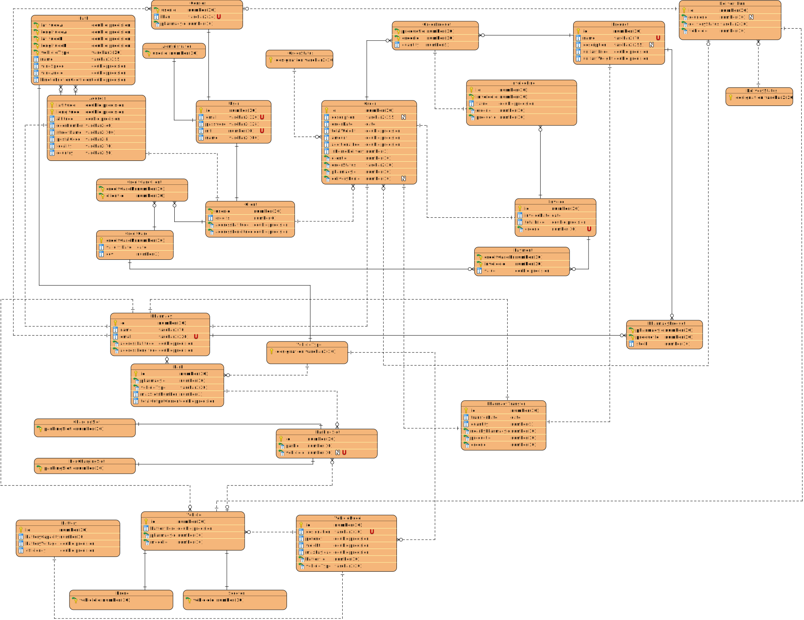

# README

This is the repository template used for student repositories in LAPR Projets.

## Java source files

Java source and test files are located in folder src.

## Maven file

Pom.xml file controls the project build.

# Notes
In this file, DO NOT EDIT the following elements:

* groupID
* artifactID
* version
* properties

Beside, students can only add dependencies to the specified section of this file.

## Eclipse files

The following files are solely used by Eclipse IDE:

* .classpath
* .project

## IntelliJ Idea IDE files

The following folder is solely used by Intellij Idea IDE :

* .idea

# How was the .gitignore file generated?
.gitignore file was generated based on https://www.gitignore.io/ with the following keywords:

  - Java
  - Maven
  - Eclipse
  - NetBeans
  - Intellij

# Who do I talk to?
In case you have any problem, please email Nuno Bettencourt (nmb@isep.ipp.pt).

# How do I use Maven?

## How to run unit tests?

Execute the "test" goals.

`$ mvn test`

## How to generate the javadoc for source code?

Execute the "javadoc:javadoc" goal.

`$ mvn javadoc:javadoc`

This generates the source code javadoc in folder "target/site/apidocs/index.html".

## How to generate the javadoc for test cases code?

Execute the "javadoc:test-javadoc" goal.

`$ mvn javadoc:test-javadoc`

This generates the test cases javadoc in folder "target/site/testapidocs/index.html".

## How to generate Jacoco's Code Coverage Report?

Execute the "jacoco:report" goal.

`$ mvn test jacoco:report`

This generates a jacoco code coverage report in folder "target/site/jacoco/index.html".

## How to generate PIT Mutation Code Coverage?

Execute the "org.pitest:pitest-maven:mutationCoverage" goal.

`$ mvn test org.pitest:pitest-maven:mutationCoverage`

This generates a PIT Mutation coverage report in folder "target/pit-reports/YYYYMMDDHHMI".

## How to combine different maven goals in one step?

You can combine different maven goals in the same command. For example, to locally run your project just like on jenkins, use:

`$ mvn clean test jacoco:report org.pitest:pitest-maven:mutationCoverage`

## How to perform a faster pit mutation analysis?

Do not clean build => remove "clean"

Reuse the previous report => add "-Dsonar.pitest.mode=reuseReport"

Use more threads to perform the analysis. The number is dependent on each computer CPU => add "-Dthreads=4"

Temporarily remove timestamps from reports.

Example:

`$ mvn test jacoco:report org.pitest:pitest-maven:mutationCoverage -DhistoryInputFile=target/fasterPitMutationTesting-history.txt -DhistoryOutputFile=target/fasterPitMutationTesting-history.txt -Dsonar.pitest.mode=reuseReport -Dthreads=4 -DtimestampedReports=false`

## Where do I configure my database connection?

Each group should configure their database connection on file: 

* src/main/resources/application.properties

# Oracle repository

If you get the following error:

```
[ERROR] Failed to execute goal on project 
bike-sharing: Could not resolve dependencies for project 
lapr3:bike-sharing:jar:1.0-SNAPSHOT: 
Failed to collect dependencies at 
com.oracle.jdbc:ojdbc7:jar:12.1.0.2: 
Failed to read artifact descriptor for 
com.oracle.jdbc:ojdbc7:jar:12.1.0.2: 
Could not transfer artifact 
com.oracle.jdbc:ojdbc7:pom:12.1.0.2 
from/to maven.oracle.com (https://maven.oracle.com): 
Not authorized , ReasonPhrase:Authorization Required. 
-> [Help 1]
```

Follow these steps:

https://blogs.oracle.com/dev2dev/get-oracle-jdbc-drivers-and-ucp-from-oracle-maven-repository-without-ides

You do not need to set a proxy.

You can use existing dummy Oracle credentials available at http://bugmenot.com.

# Project Report

This part of the Readme file will explain the purpose of our LAPR3 Project, our approaches and some considerations regarding the work done.

About the project, we want to mention this **6** topics:

### 1. Goal

* The goal of our LAPR3 project was to develop a full functional software that supports the delivery of pharmaceutics products.
* This software has to be capable of handling customers, pharmacies, orders, deliveries, users, products. 

### 2. Objectives


### 3. Actors (Personas)

- Administrator
- Courier
- Client
- User
- System

### 4. Functionalities (by area)

1. **Client** 
    
    1.1 A client has to be capable of registering himself.([US18_RegisterClient](docs/Iteration 3/User Management/Refinement/US18_RegisterClient/US18_RegisterClient.md)) 

    1.2 A client has to be capable of making an order.([US25_MakeAnOrder](docs/Iteration 3/Make An Order/Refinement/US25_MakeAnOrder/US25_MakeAnOrder.md))

2. **Pharmacies**

    2.1 The Administrator should be capable of registering a pharmacy. ([US40_RegisterPharmacy](docs/Iteration%203/Pharmacy%20Management/Refinement/US40_RegisterPharmacy/US40_RegisterPharmacy.md)) 

    2.2 The Administrator should be capable of update a pharmacy. ([US53_UpdatePharmacy](docs/Iteration 3/Pharmacy Management/Refinement/US53_UpdatePharmacy/US53_UpdatePharmacy.md))
   
    2.3 The Administrator should be capable of adding products to the pharmacy. ([US64_AddPharmacyProducts](docs/Iteration 3/Pharmacy Management/Refinement/US64_AddPharmacyProducts/US64_AddPharmacyProducts.md))
    
    2.4 The Administrator should be capable of making a product transfer between pharmacies. ([US200_MakeAPharmacyTransfer](docs/Iteration 3/Pharmacy Management/Refinement/US200_MakeAPharmacyTransfer/US200_MakeAPharmacyTransfer.md))
    
    2.5 As necessary, the program should be capable of transfering stock between pharmacies and issuing a transfer note. ([US202_IssueTransferNote](docs/Iteration 3/Pharmacy Management/Refinement/US202_IssueTransferNote/US202_IssueTransferNote.md))

    2.6 The Administrator should be capable of issuing a pharmacy transfer delivery note. ([US203_IssueDeliveryNote](docs/Iteration 3/Pharmacy Management/Refinement/US203_IssueDeliveryNote/US203_IssueDeliveryNote.md))

3. **Orders**
   
   3.1 The system generates an invoice. ([US26_GenerateInvoice](docs/Iteration 3/Make An Order/Refinement/US26_GenerateInvoice/US26_GenerateInvoice.md))

   3.2 The order can't be done, therefore, the client is notified, and the order is removed. ([US74_NotifyAndRemove](docs/Iteration 3/Make An Order/Refinement/US74_NotifyAndRemove/US74_NotifyAndRemove.md))

   3.3 Know the order associated to a courier. ([US48_KnowDelivery](docs/Iteration 3/Delivery Management/Refinement/US48_KnowDelivery/US48_KnowDelivery.md))
   
4. **Deliveries**

   4.1 **Courier**
      
   - 4.1.1 An administrator should be able of register a courier. ([US19_RegisterCourier](docs/Iteration 3/Courier Management/Refinement/US19_RegisterCourier/US19_RegisterCourier.md))
   - 4.1.2 An administrator should be able of remove a courier. ([US20_RemoveCourier](docs/Iteration 3/Courier Management/Refinement/US20_RemoveCourier/US20_RemoveCourier.md))
   - 4.1.3 An administrator should be able of update a courier. ([US29_UpdateCourier](docs/Iteration 3/Courier Management/Refinement/US29_UpdateCourier/US29_UpdateCourier.md))
   
   4.2 **Vehicles**
   
   - 4.2.1 **Scooter**
        - 4.2.1.1 An administrator should be able of register a scooter.([US21_RegisterScooter](docs/Iteration 3/Scooter Management/Refinement/US21_RegisterScooter/US21_RegisterScooter.md))
        - 4.2.1.2 An administrator should be able of remove a scooter.([US22_RemoveScooter](docs/Iteration 3/Scooter Management/Refinement/US22_RemoveScooter/US22_RemoveScooter.md))
        - 4.2.1.3 An administrator should be able of update a scooter.([US32_UpdateScooter](docs/Iteration 3/Scooter Management/Refinement/US32_UpdateScooter/US32_UpdateScooter.md))
        - 4.2.1.4 An administrator should be able of see the scooter information.([US57_ScooterInformation](docs/Iteration 3/Scooter Management/Refinement/US57_ScooterInformation/US57_ScooterInformation.md))
        - 4.2.1.5 A courier should be able of park a scooter.([US289_SplitChargingCapacity](docs/Iteration 3/Scooter Management/US289_SplitChargingCapacity/US289_SplitChargingCapacity.md))
        - 4.2.1.6 A courier should be able of know if there is a parking slot available on a pharmacy. ([US77_AvailableChargingSlot](docs/Iteration 3/Delivery Management/Refinement/US77_AvailableChargingSlot/US77_AvailableChargingSlot.md))
    - 4.2.2 **Drone**
      - 4.2.2.1 An administrator should be able of register a drone.([US193_RegisterDrone](docs/Iteration 3/Drone Management/Refinement/US193_RegisterDrone/US193_RegisterDrone.md))
      - 4.2.2.2 An administrator should be able of remove a drone.([US194_RemoveDrone](docs/Iteration 3/Drone Management/Refinement/US194_RemoveDrone/US194_RemoveDrone.md))
      - 4.2.2.3 An administrator should be able of update a drone.([US195_UpdateDrone](docs/Iteration 3/Drone Management/Refinement/US195_UpdateDrone/US195_UpdateDrone.md))
   - 4.2.3 **Both**
      - 4.2.3.1 An administrator should be able of know the vehicle maximum payload. ([US55_MaxPayload](docs/Iteration 3/Delivery Management/Refinement/US55_MaxPayload/US55_MaxPayload.md))
      - 4.2.3.2 An administrator should be able of know the best vehicle for an order.([US290_SeeSuitableVehicle](docs/Iteration 3/Delivery Management/Refinement/US290_SeeSuitableVehicle/US290_SeeSuitableVehicle.md))
      
   4.3 **Delivery Run**

      - 4.3.1 An administrator should be able of register a Delivery Run. ([US206_RegisterDeliveryRun](docs/Iteration 3/Delivery Management/Refinement/US206_RegisterDeliveryRun/US206_RegisterDeliveryRun.md))

      - 4.3.2 A courier should be able of starting a Delivery Run. ([US205_StartDeliveryRun](docs/Iteration 3/Delivery Management/Refinement/US205_StartDeliveryRun/US205_StartDeliveryRun.md))

      - 4.3.3 A courier should be able of end a Delivery Run. ([US303_FinishDeliveryRun](docs/Iteration 3/Delivery Management/US303_FinishDeliveryRun/US303_FinishDeliveryRun.md))

5. **Users**
   
   5.1 A user has to be capable of loging in ([US67_Login](docs/Iteration 3/User Management/Refinement/US67_Login/US67_Login.md))

   5.2 A user has to be capable of loging out ([US68_Logout](docs/Iteration 3/User Management/Refinement/US68_Logout/US68_Logout.md))

6. **Products**
   
   6.1 An administrator should be able of register a Product. ([US70_RegisterProduct](docs/Iteration 3/Product Management/Refinement/US70_RegisterProduct/US70_RegisterProduct.md))

   6.2 An administrator should be able of update a Product. ([US71_UpdateProduct](docs/Iteration 3/Product Management/Refinement/US71_UpdateProduct/US71_UpdateProduct.md))

   6.3 An administrator should be able of remove a Product. ([US72_RemoveProduct](docs/Iteration 3/Product Management/Refinement/US72_RemoveProduct/US72_RemoveProduct.md))

   6.4 An administrator should be able of know a Product information. ([US73_ProductInformation](docs/Iteration 3/Product Management/Refinement/US73_ProductInformation/US73_ProductInformation.md))

## Physics Report

### Drone

In order to move a drone and keep it steady on the air, is necessary that the 4 forces that interact with it (**Lift**, **Weight**, **Drag** and **Thrust**) cancel each other. 
- **Drag**
    - Drag (or air resistance) is a force acting opposite to the relative motion of any object moving with respect to a surrounding fluid.
    - This can exist between two fluid layers (or surfaces) or a fluid and a solid surface. Unlike other resistive forces, such as dry friction, which are nearly independent of velocity, drag force depends on velocity.
- **Lift**
    - A fluid flowing around the surface of an object exerts a force on it. Lift is the component of this force that is perpendicular to the oncoming flow direction. 
    - It contrasts with the drag force, which is the component of the force parallel to the flow direction. Lift conventionally acts in an upward direction in order to counter the force of gravity, but it can act in any direction at right angles to the flow.
- **Weight**
    - The weight of an object is the force acting on the object due to gravity.
- **Thrust**
    - Thrust is a reaction force described quantitatively by Newton's third law. 
    - When a system expels or accelerates mass in one direction, the accelerated mass will cause a force of equal magnitude but opposite direction, to be applied to that system.
    - The force applied on a surface in a direction perpendicular or normal to the surface is also called thrust.
    
In our work, in order to make it more similiar to reality, instead of using a constant speed, we've used an optimum flying speed. 
To obtain an optimum flying speed, where the parasite drag is smaller, and the lift/drag ratio is the most efficient to the flying requirements, we used this formula:


**where**

- m is the total mass (drone+payload) (in kg)
- Cd is the drag coefficient
- A is the drone's frontal area (in m^2)
- b is the drone's width (in m)
- ρ is the air density (in kg . m^-3)


that has in count the induced drag, and the parasite drag.

- With this speed, we now have to consider the wind speed and its angle, using this formula,


**where**

- v_wind is the wind speed (in m/s)
- α is the angle formed between the wind speed and the air/drone speed pair. (in degrees)

and then we added both speeds to know what was the effective speed.


With the speed calculated, we have to use the following formula:


**where**

- m is the total mass (drone+payload) (in kg)
- Cd is the drag coefficient
- A is the drone's frontal area (in m^2)
- b is the drone's width (in m)
- ρ is the air density (in kg . m^-3)
- v is the total velocity calculated in the step before. (in m/s)

that adds the parasitic drag and the induced drag.

Using the energy formula:


We got the consumption of energy in the hover for the distance.

In order to lift the drone, there is necessary to the thrust, air resistance and weight cancel each order. Studies have shown that the power it consumes to lift is approximately linearly proportional to the weight of the vehicle under practical assumptions. We assumed that  the power consumed during takeoff and landing is, on average, approximately equivalent to the power consumed during hover.
The lifting power formula that we used is on "Energy Consumption in Unmanned Aerial Vehicles" (formula 22)


**where**

- T is the thrust and is equivalent to the weight (mass x gravitic acceletration) (in N)
- A is the drone's frontal area (in m^2)
- ρ is the air density (in kg . m^-3)

With the hover force and the lifting power, we are able to calculate the total energy consumption of the drone.
To the lifting part of the movement, with the power formula: 


**where**
- P is the power (in W)
- E is the energy (in J)
- t is the time (in s)

and knowing that the speed formula is:


**where**
- v is the velocity (in m/s)
- d is the distance (in m)
- t is the time (in s)

assuming the lifting speed as the hover speed and the distance as the default height (150m), we have:


that translates to:


So, the overall drone consumption is:


**where**
- E is the total energy in kWh

### Scooter

In order to calculate the scooter energy consumption, we first calculated the forces that actuated in the scooter during the path.

First we considered the friction force that is the interaction of the wheels material with the floor, measuring hom much energy is necessary to make the scooter move in that kind of street pavement. We used the formula: 


**where**
- m is the mass of the scooter+orders+courier (in kg)
- g is the gravitic acceleration (in m.s^-2 )
- μ is the kinetic friction coefficient

After that, we considered the overall weight, considering the inclination using the formula: 


**where**
- m is the mass of the scooter+orders+courier (in kg)
- g is the gravitic acceleration (in m.s^-2 )
- α is the angle of the inclination (in degrees)

For the last part we considered the air resistance and the wind, using the following formula to calculate the wind effective speed: 


**where**

- v_wind is the wind speed (in m/s)
- α is the angle formed between the wind speed and the air/drone speed pair. (in degrees)

and then we added both speeds to know what was the effective speed.


With the total spped calculated, we calculated the air resistance force :


**where**
- m is the total mass (scooter+courier+payload) (in kg)
- Cd is the drag coefficient
- A is the scooter's frontal area (in m^2)
- ρ is the air density (in kg . m^-3)
- v is the total velocity calculated in the step before. (in m/s)

So, the overall scooter force is:


and using the formula 


**where**

- E is the total energy in kWh

we got the energy that the scooter spends doing the path.

###Calculation considerations

- In order to check if a vehicle is capable of doing the path (due to motor power), we used the following formula:


**where**

- P is the motor power (in Watt)
- F is the necessary force to the path (in N)
- v is the total velocity (in m/s)

When the vehicle wasn't able to make the path, we reduced the velocity (in a 0.01 m/s ratio in a recursive way) and calculated again the force, until the F.v fited the vehicle power, or until the velocity be 0, what made the vehicle not capable of make the path. 
We used the final energy in kWh but during the calculation we use Joules. We just convert to kWh at the final to make it easier to the battery integration.

- The constants used were:

- g: gravitic acceleration - 9.8 m.s^-2
- ρ: air density - 1.225 kg.m^-3
- h: default drone height - 150 m
- A: default drone area - 0.3 m^2
- Cd: default drag coefficient - 1.1
- v: default scooter velocity - 8.3 m/s
- m: default courier weight - 80 kg
- b: default drone width - 0.2 m

# Relational Model (Normalized)



# Domain Model


#Bibliography

- Energy Consumption in Unmanned Aerial Vehicles: A Review of Energy Consumption Models and Their Relation to the UAV Routing: THIBBOTUWAWA, Amilia et all, ISBN : 978-3-319-99995-1
- 12F - VENTURA, Graça et all ISBN: 978 972 47 5488 8
- https://hypertextbook.com/facts/2006/MatthewMichaels.shtml
- https://4.bp.blogspot.com/_urSQl6wUA5g/TTZFTUOs6FI/AAAAAAAAIe8/zeE_bHhBpOE/s1600/drag_chart.jpg
- https://www.endless-sphere.com/forums/viewtopic.php?p=843530
- https://info.simuleon.com/blog/how-to-calculate-drag-coefficient-for-motorcycle
- https://en.wikipedia.org/wiki/Drag_(physics)
- https://en.wikipedia.org/wiki/Thrust
- https://en.wikipedia.org/wiki/Weight
- https://en.wikipedia.org/wiki/Lift_(force)
- https://en.wikipedia.org/wiki/Density_of_air
- https://analyticcycling.com/ForcesPower_Page.html
- https://www.wired.com/story/the-physics-of-why-bigger-drones-can-fly-longer/
- https://www.engineeringtoolbox.com/drag-coefficient-d_627.html
- https://dieselnet.com/standards/cycles/wltp.php
- https://electricscooterparts.com/motor-power-calculator.html
- https://www.intechopen.com/books/flight-physics-models-techniques-and-technologies/helicopter-flight-physics
- https://www.sciencedirect.com/science/article/pii/S1361920920308531?via%3Dihu
- https://www.stackoverflow.com/
- https://stackoverflow.com/a/25885587
- https://www.tutorialspoint.com/c_standard_library
- https://www.geeksforgeeks.org/how-to-generate-and-read-qr-code-with-java-using-zxing-library/
- https://stackoverflow.com/questions/10305153/generating-all-possible-permutations-of-a-list-recursively