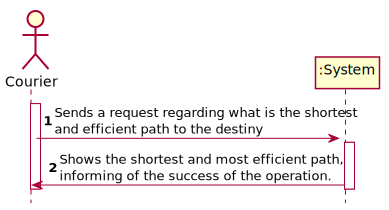
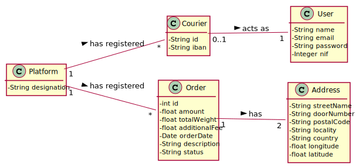
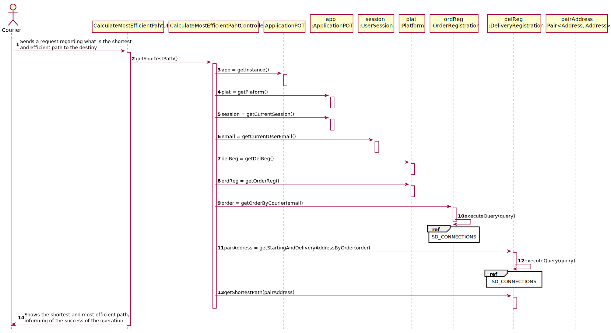
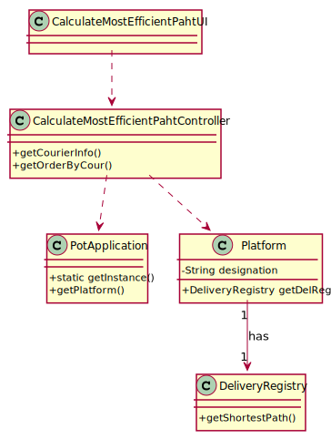

# US 23 - Calculate Most Efficient Path

## 1. Requirements Engineering

### SSD

## 2. OO Analysis

### Part of the Domain Model Relevant for the US

## 3. Design - Use Story Realization

###	Sequence Diagram

###	Class Diagram

