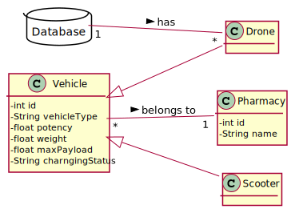
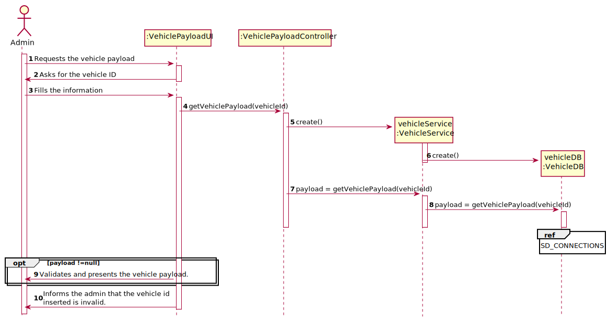

# US 55 - Max Payload

## 1. Requirements Engineering

### SSD

## 2. OO Analysis

### Part of the Domain Model Relevant for the UC

## 3. Design - Use Case Realization

###	Sequence Diagram

###	Class Diagram

